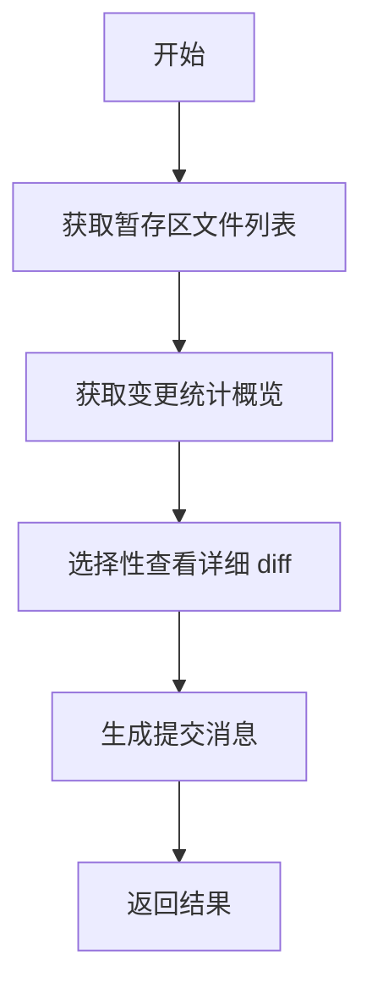

# Git Commit Message Generator

[](LICENSE)
[](https://code.visualstudio.com/)

基于 AI 自动生成 Git 提交信息的工具集。通过分析 **已暂存的变更（staged changes）**，结合 DeepSeek 大模型，智能生成高质量的 Git Commit Message。

---

## 📦 项目结构

本仓库是一个 **npm monorepo**，包含以下子包：

| 包名                                                               | 目录                | 说明                                        |
| ------------------------------------------------------------------ | ------------------- | ------------------------------------------- |
| [`@cicara/git-commit-message-generator`](./lib)                    | `lib/`              | 核心库，提供 AI 驱动的 Git 提交信息生成能力 |
| [`@cicara/git-commit-message-generator-cli`](./cli)                | `cli/`              | CLI 命令行工具                              |
| [`cicara-vscode-git-commit-message-generator`](./vscode-extension) | `vscode-extension/` | VS Code 扩展，一键生成提交信息              |

---

## ✨ 核心特性

- 🤖 **AI 驱动**：使用 DeepSeek V4 系列模型，理解代码变更上下文
- 🔧 **结构化 Git 工具**：AI 可调用 `git-staged-files`、`git-staged-files-stat`、`git-staged-files-diff` 工具获取仓库状态
- 📐 **Schema 校验输出**：通过 Zod Schema 确保生成的提交消息格式规范
- 🧩 **可插拔架构**：基于 [Genkit](https://firebase.google.com/docs/genkit)，支持接入任意模型提供商
- 🖱️ **一键生成**（VS Code）：在 SCM 面板点击按钮即可生成并自动填入提交消息
- ✏️ **自定义 Prompt**：支持在配置中注入自定义提示词或外部 prompt 文件

---

## 🚀 快速开始

### 前置条件

- Node.js >= 22
- DeepSeek API Key（前往 [DeepSeek 开放平台](https://platform.deepseek.com/) 获取）

### 安装

```bash
# 安装依赖
npm install

# 构建所有子包
npm run build -w lib
npm run build -w vscode-extension
```

### 使用核心库

```ts
import { GitCommitMessageGenerator } from "@cicara/git-commit-message-generator";
import { deepSeek } from "@genkit-ai/compat-oai/deepseek";

const generator = new GitCommitMessageGenerator(
  "/path/to/git/repo",
  deepSeek({ apiKey: "sk-..." }),
  deepSeek.model("deepseek-v4-flash"),
);

const result = await generator.generateCommitMessage("Use conventional commits format");
console.log(result?.message); // feat: add user authentication module
console.log(result?.summary); // explanation for why this message was chosen
```

### 使用 VS Code 扩展

1. 在 VS Code 扩展市场搜索 **"Cicara Git Commit Message Generator"** 安装
2. 在 `settings.json` 中配置 API Key：

```json
{
  "git-commit-message-generator.deepseekApiKey": "sk-xxxxxxxxxxxxxxxx"
}
```

3. 打开 SCM 面板，暂存你的改动后点击标题栏的 ✨ 按钮即可生成提交消息

---

## ⚙️ 工作原理

AI 模型会按照以下 4 步工作流程生成提交消息：



1. **获取暂存区文件列表** — 调用 `git-staged-files` 获取 staged 和 deleted 文件
2. **获取变更统计** — 调用 `git-staged-files-stat` 了解整体变更范围
3. **选择性 diff** — 调用 `git-staged-files-diff` 查看核心业务代码的详细差异（自动跳过 lock 文件、构建产物、二进制文件等）
4. **生成提交消息** — 基于获取的信息生成结构化的 commit message 及生成理由

---

## 📄 许可证

[MIT](LICENSE)
